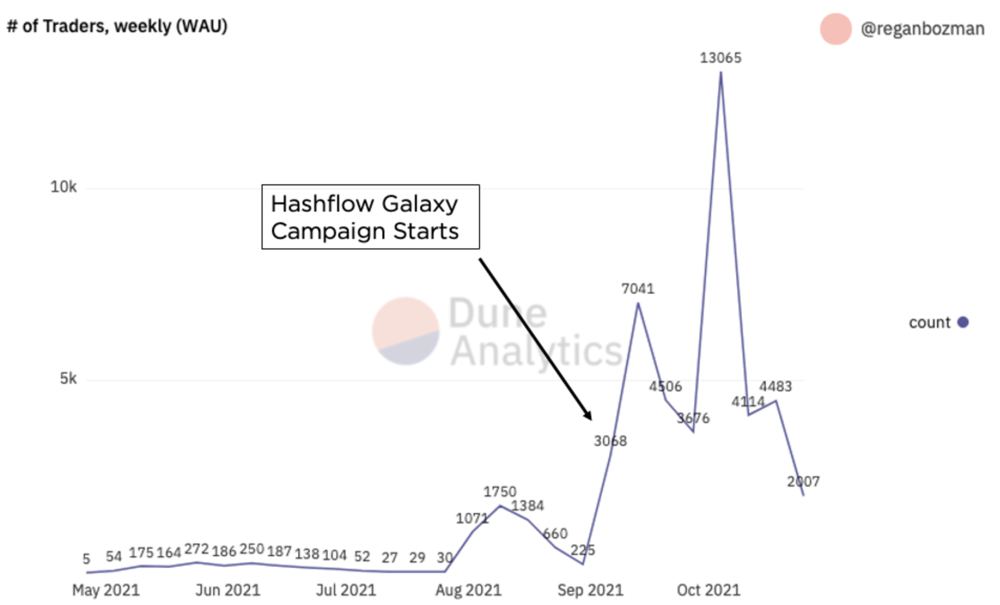

# Protocol Growth: Hashflow

Written by:

Lattice Capital

## Challenge

Growth in Web3 is difficult; Web3 has no app stores, no targeted Facebook ads, no email marketing, no re-marketing, no affiliate marketing...yeah, you get it. The tools relied upon by Silicon Valley growth marketers over the past decade have largely evaporated in our industry, and we've been left with only a couple arrows in the quiver. Beyond meme contests and an active Twitter account, Web3 teams have relied mainly on token incentives for early adopters. Using tokens as an incentive, while successful in some instances, is more recently being called into question as it has trained parasitic behavior as users rush into projects with liquidity to earn tokens only to dump them and when the incentives dry up, say goodbye to those users.

Hashflow is a new decentralized exchange that launched into [Private Alpha](https://blog.hashflow.com/launching-hashflows-open-alpha-f7619a02b11e) in early August. The Hashflow protocol is unique in that it connects users on-chain directly to leading crypto market makers. It makes swapping tokens both:

* Gas-efficient (~50% cheaper than Uniswap) - even with Uniswap v3, AMMs still offer high fees, frontrunning, sandwich attacks, gas inefficiency, and frequent [failed transactions](https://etherscan.io/txs?a=0x7a250d5630b4cf539739df2c5dacb4c659f2488d&__cf_chl_jschl_tk__=567a4d13ead9a2f3b9e78f9235fc46b186967ccf-1613059039-0-AZOqYWcjdbyywN9nZK7j41ukvEFAhMIIsHsdmoo9V697LmHRurAJD16ZbN7YQu9K9ilUGlb4MwpNv73xa1p1-RnkLCo6-UNeUBUpKDy4aKTGLZGkukfS9dGhxyP-Lt0NF2fYMN2ISlXxF583p1-l55Pl965UwJiPT2BmNc6Xv0QMl7CJ487b6vstQhZfUxy_u3NEFbJT5kY6YWOBcrM9a8EDFtiKnpT7VxhndDeaEonYdoy9UkXm5X9Km6_1mxe1LzjUlqAOxwRxhsUX4jQkDN1-6ZHwB6CPedvJXai5a8pntLirGxeQIIUR4-lKnw1hO0o_oWvOiZ7woe_rk2y6adpO2XjqnfeZrVCWFfvKLeuP4tLw7y-GMcNuGT5YJfZfGw). It is still unclear if any AMM will be able to solve these problems fundamentally.
* Capital-efficient - as [highlighted](https://blog.hashflow.com/the-capital-efficiency-era-of-defi-d8b3427feae4) by Pranay, the baseline measure of capital efficiency is the utilization rate of assets. In the context of decentralized exchanges, we measure utilization in a slightly different way than for lending protocols: *Utilization Rate = Daily Trading Volume / TVL.* During Open Alpha and Open Beta phases, Hashflow showed impressive metrics: market makers increased TVL to [$1.2M](https://twitter.com/hashflownetwork/status/1447627774009643011?s=21), while the average daily trading volume during the Open Alpha phase was around [$3.2M](https://dune.xyz/Hashflow/Hashflow).

Despite those compelling advantages, growing trading volume can be a challenge as crypto traders have many other options, both centralized and decentralized, and it is especially challenging when you don't have a governance token to juice activity.

## Solution

Hashflow not having a token early led to some questioning from early community members. Even months before the release of their closed alpha product, most of them tended to be skeptical about the advantages of being an early user, even if the core team ensured they were having discussions about potential mechanics to reward early contributors.

When Galxe was introduced to the Hashflow team, it seemed pretty evident that this could lead to a great collaboration to incentivize and reward early community members with NFTs.

In September, Hashflow and Galxe [announced](https://blog.galxe.com/hashflow-invades-the-galxe-with-the-hashbot-d5f87cd07af1) a partnership to utilize the credential-based NFT infrastructure and launched the Hashbot Genesis campaign. They also activated an exclusive, one-of-a-kind NFT that personifies the badass tech powering Hashflow called The Hashbot. This 1st issue was claimable by all Private Alpha users. Since that first drop, Hashflow has been incentivizing its users’ thanks to the infrastructure provided by Galxe:

* Hashflow used Galxe to reward the HashMatic Trading Competition winners by offering a Diwali-inspired, MATIC-themed Hashbot poster.
* For Halloween, Hashflow released a special Hashbot art for the most loyal #hashgang members who continue to grow and strengthen the community.

With ten drops and more than 20,850 NFTs minted, Galxe has been a great tool to show the community-driven growth of Hashflow truly its most loyal users own Hashflow. The goal has always been to distribute rewards fairly to ensure that Hashflow is owned by its most loyal users.

> “We have seen explosive demand around on-chain credentialing and on-chain marketing in the Web3 space. Hashflow's campaigns demonstrated how projects and DAOs can leverage the combination of on-chain credentials and achievement-based NFTs to bring the community engagement to the next level.”

Charles Wayn, Co-Founder Galxe

On October 6th, Hashflow [tweeted](https://twitter.com/hashflownetwork/status/1445887519342481420) that they crossed $250M trading volume. Metrics have been [growing](https://dune.xyz/Hashflow/Hashflow) tremendously since then.

The Galxe Campaign also had a significant impact on Hashflow WAU's

> "We believe that NFTs are a great way to do brand acquisition and build the cult following. Galxe understood this thesis extremely well and have done an amazing job at catering to our needs and feedback and executed flawlessly despite the pressure.  Can't wait for many more collaborations that lie ahead!"

Varun Kumar, CEO Hashflow

That is why we got so excited when we met the Galxe team this past summer; they are changing how truly Web3 companies grow, putting more growth arrows in the quiver. Galxe is building an on-chain credential system using NFTs, providing protocols and DAOs with actionable data to acquire and retain users more effectively. Protocols can then leverage these indexed and curated data sets to set up various reward systems for their most loyal users. With the explosion in popularity of NFTs this year, the token is no longer the only game in town to incentivize positive user behavior.

## Results

* Nearly 30,000 users minted Hashflow’s NFTs on Ethereum mainnet on Galxe during a six-week campaign
* Hashflow weekly active users grew from 3,000 to 13,000+
* Following the start of the Galxe campaign, Hashflow’s monthly trading volume skyrocketed from $19.8M in August to $673M in October

Read more about the results [here](https://mirror.xyz/0x377B581957f447D2C56C08a0af23586c5a3B2577/IkNz6sQZgICuiOFqAoOxa8nlaNGrqlzvSMrL_xS2Drw).